Hello Alexey!
To save your time here is a Canary deployment result:
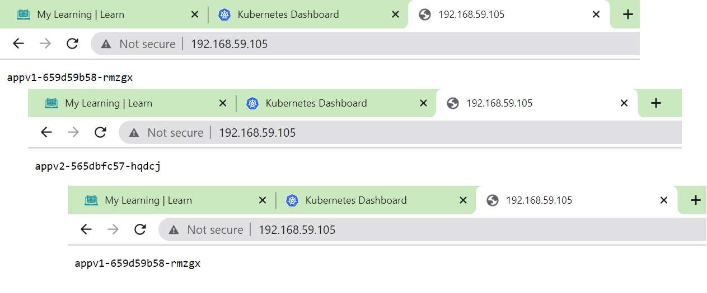
The following text represents the same in more details  :)
Kind regards
Tatiana

### ConfigMap & Secrets
Try connect to pod with curl (curl pod_ip_address). What happens?
From you PC
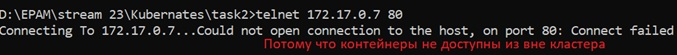
From minikube (minikube ssh)
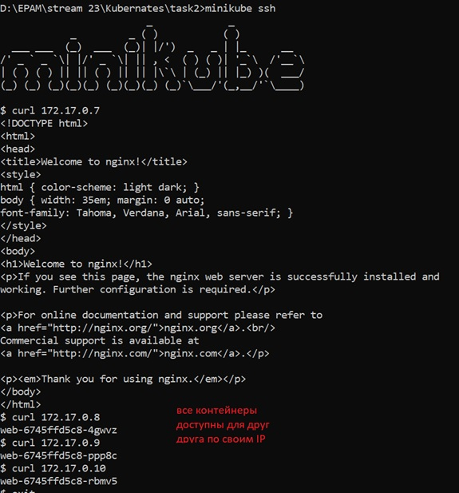
From another pod (kubectl exec -it $(kubectl get pod |awk '{print $1}'|grep web-|head -n1) bash)
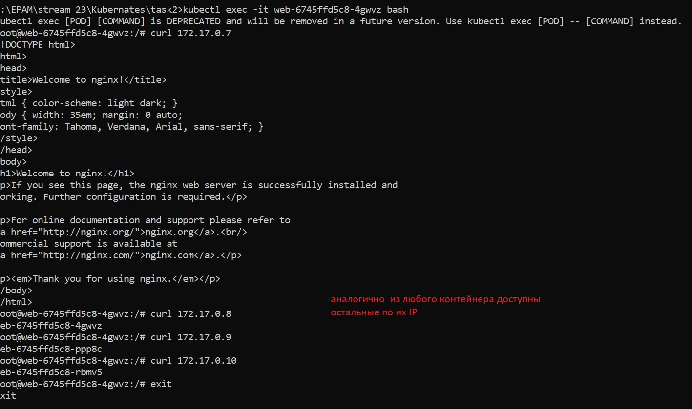

### Create service (ClusterIP)
Try connect to service (curl service_ip_address). What happens?
From you PC
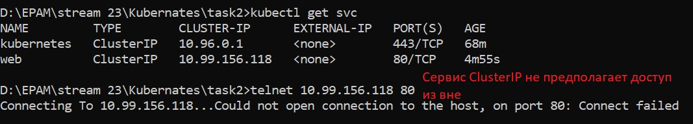
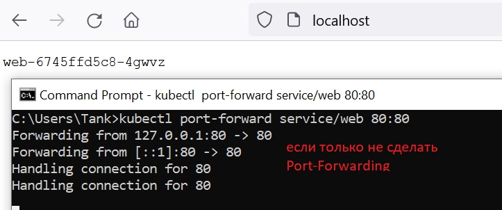
From minikube (minikube ssh) (run the command several times)
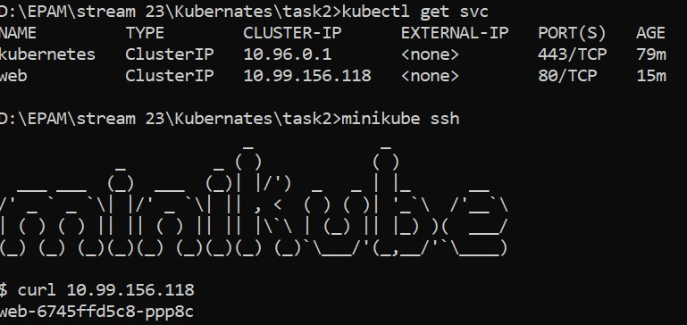
From another pod (kubectl exec -it $(kubectl get pod |awk '{print $1}'|grep web-|head -n1) bash) (run the command several times)
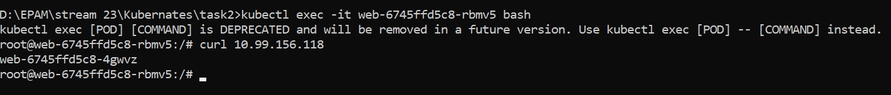

###NodePort
Checking the availability of the NodePort service type
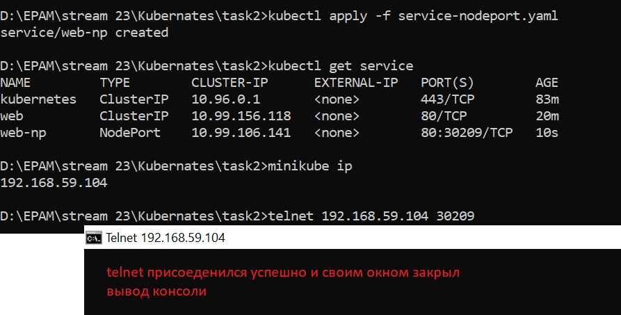

### DNS
Compare the IP address of the DNS server in the pod and the DNS service of the Kubernetes cluster.
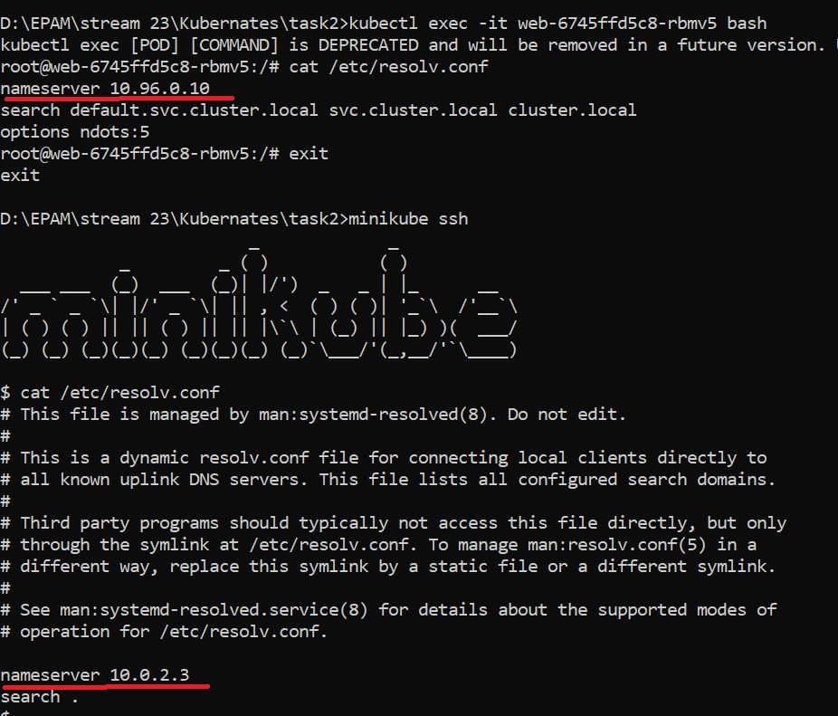
Inside the pod run nslookup to normal clusterip and headless. Compare the results.You will need to create pod with dnsutils.
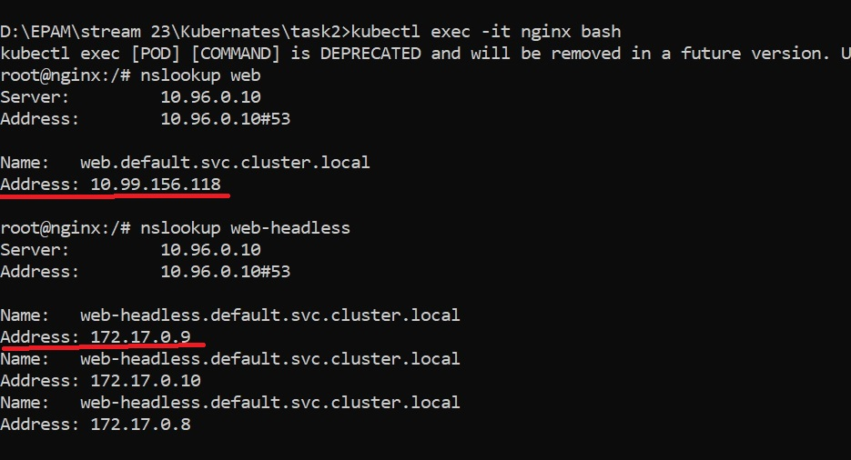

### Ingress
Let's see what the ingress controller creates for us
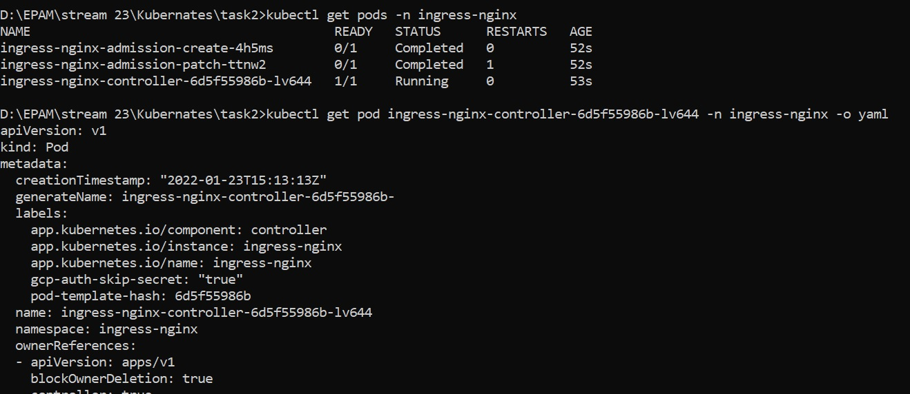
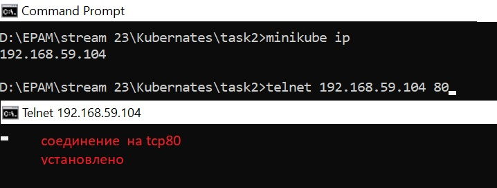

### HOMEWORK
In Minikube in namespace kube-system, there are many different pods running. Your task is to figure out who creates them, and who makes sure they are running (restores them after deletion).
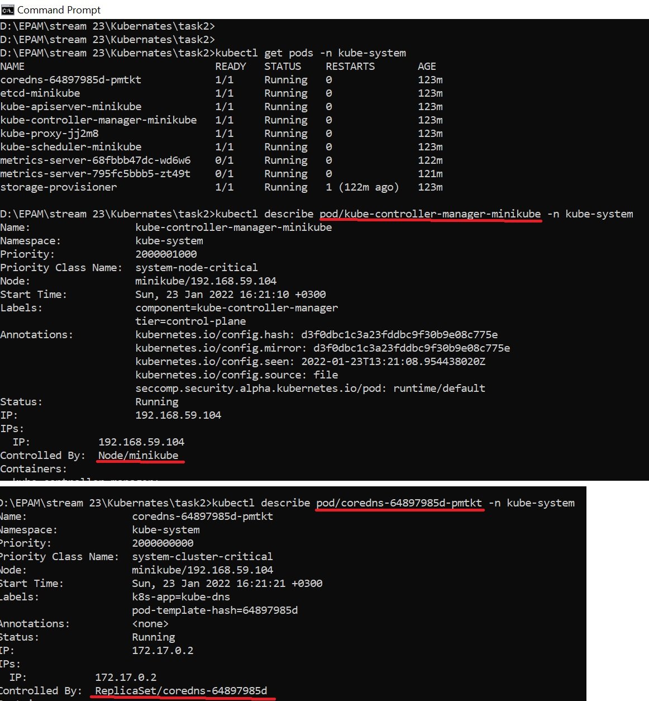

Implement Canary deployment of an application via Ingress. Traffic to canary deployment should be redirected if you add "canary:always" in the header, otherwise it should go to regular deployment. Set to redirect a percentage of traffic to canary deployment.
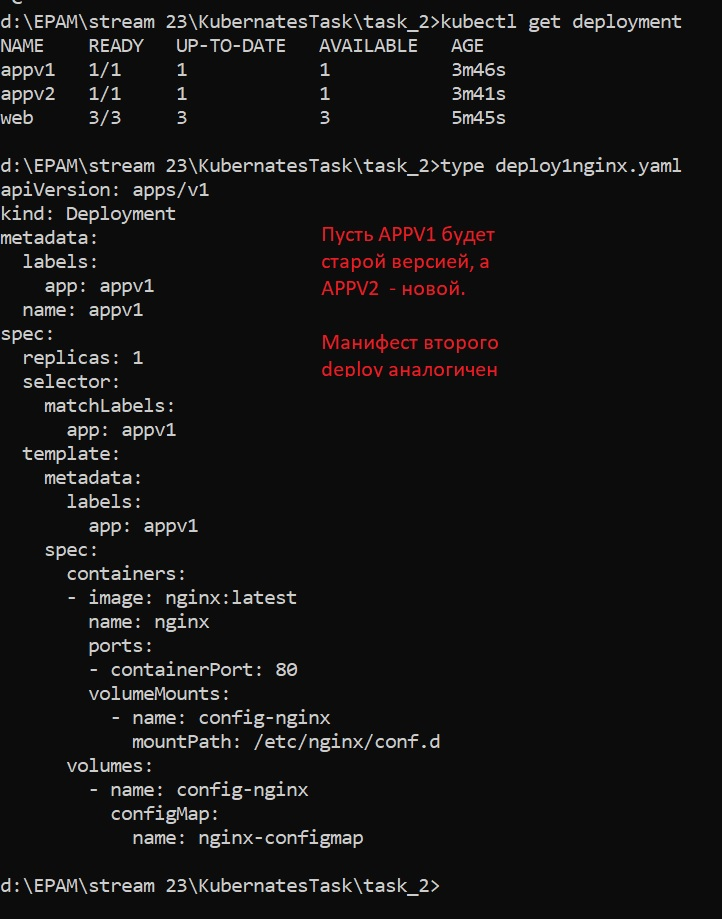
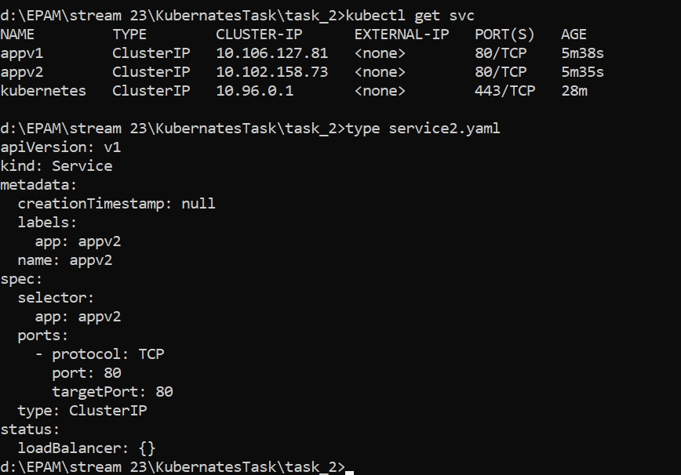
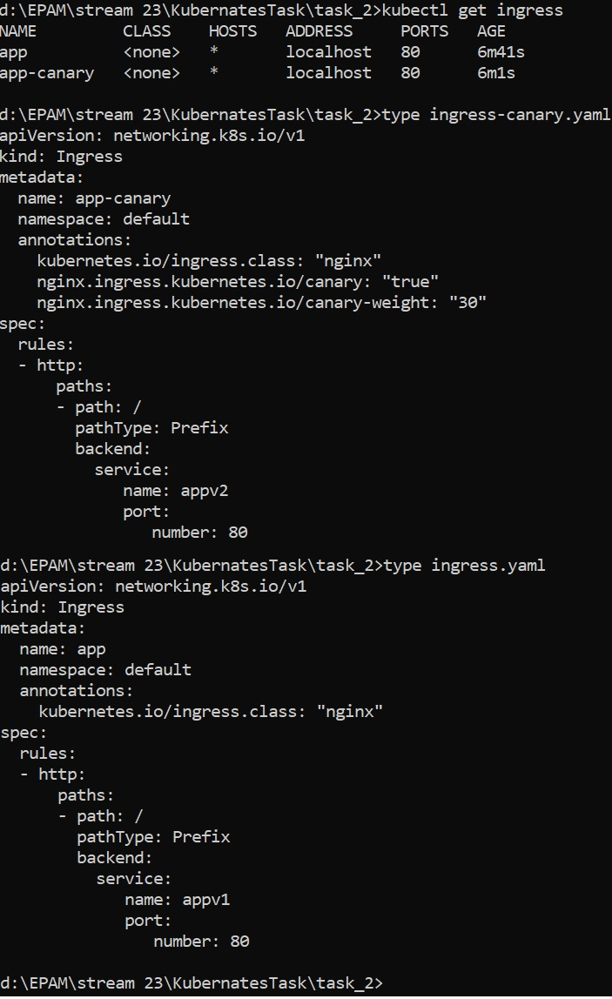
