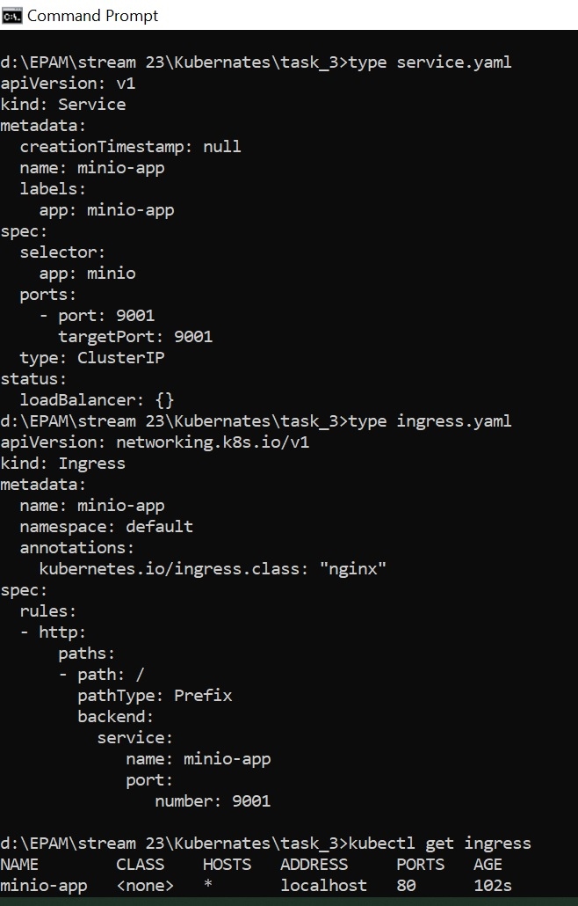
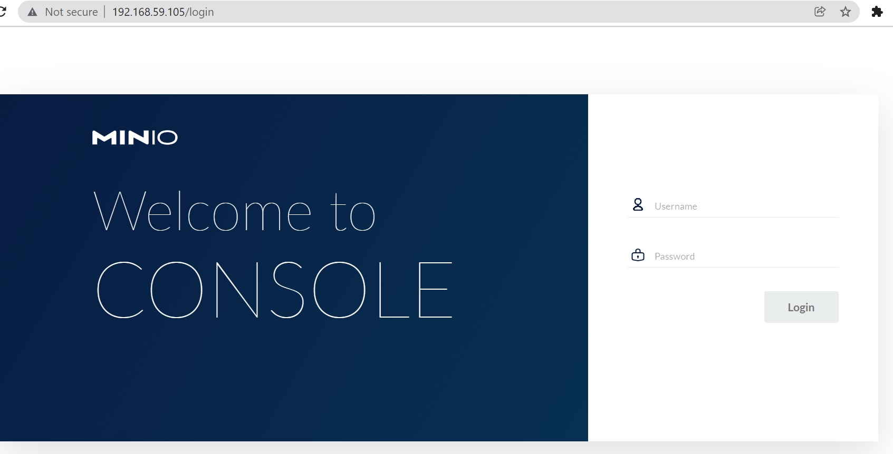
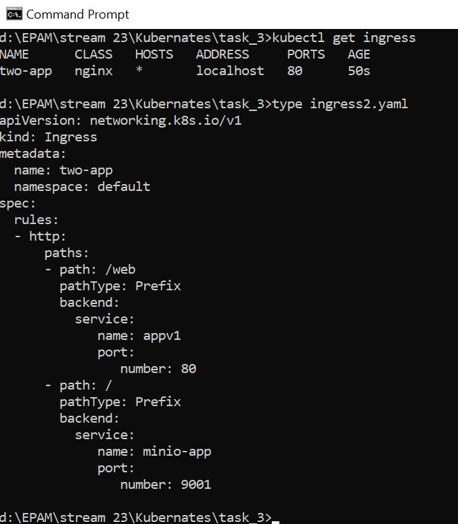
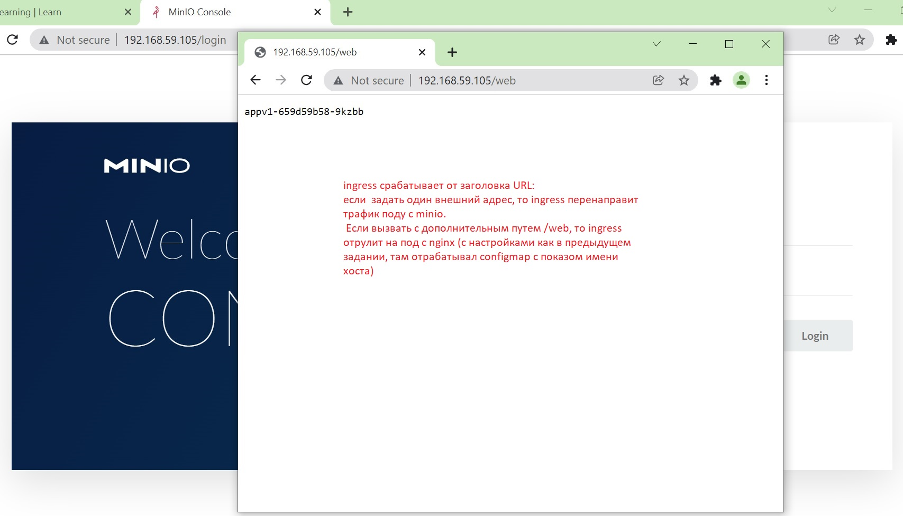
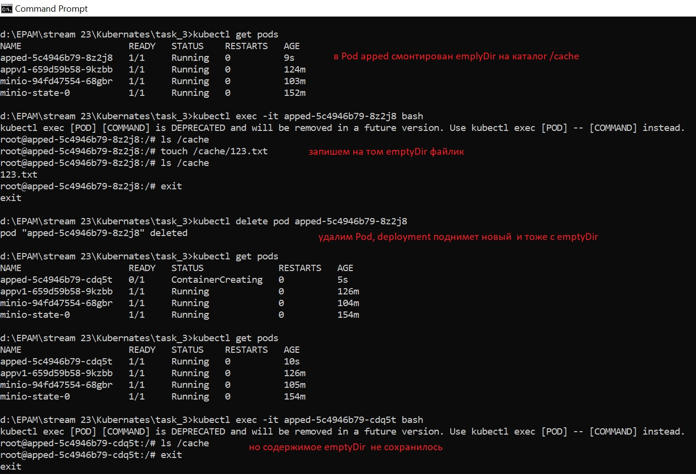

## Hello Alexey!
### Please pay attention on comments in the screenshots. Kind regards Tatiana

## Homework
### We published minio "outside" using nodePort. Do the same but using ingress.

### Publish minio via ingress so that minio by ip_minikube and nginx returning hostname (previous job) by path ip_minikube/web are available at the same time.

### Create deploy with emptyDir save data to mountPoint emptyDir, delete pods, check data.

### Optional. Raise an nfs share on a remote machine. Create a pv using this share, create a pvc for it, create a deployment. Save data to the share, delete the deployment, delete the pv/pvc, check that the data is safe.
