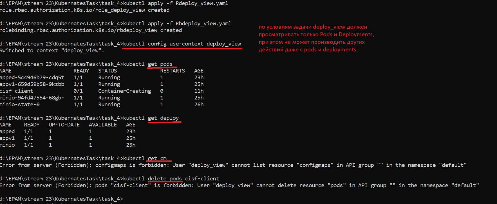
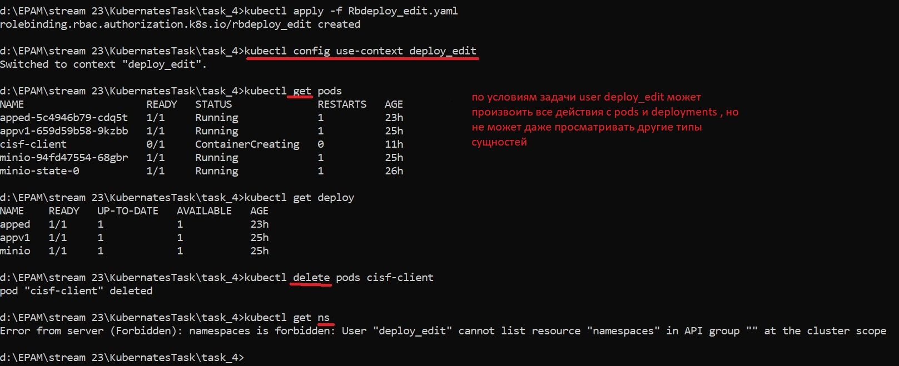
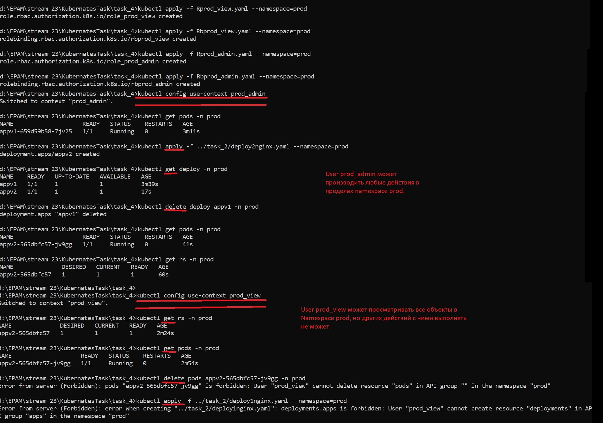
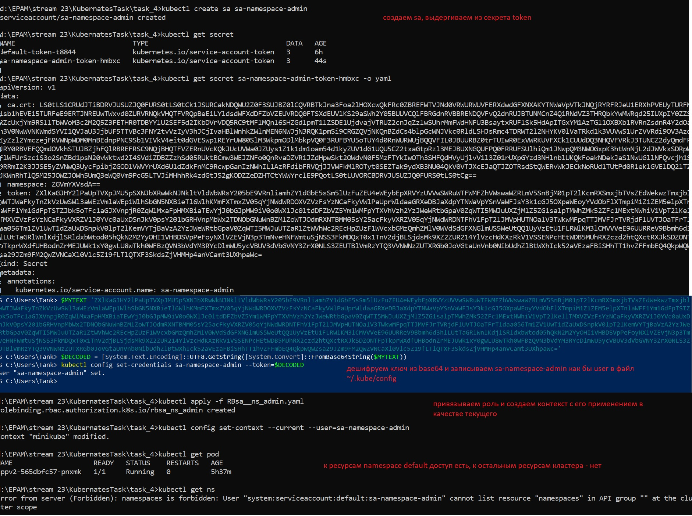
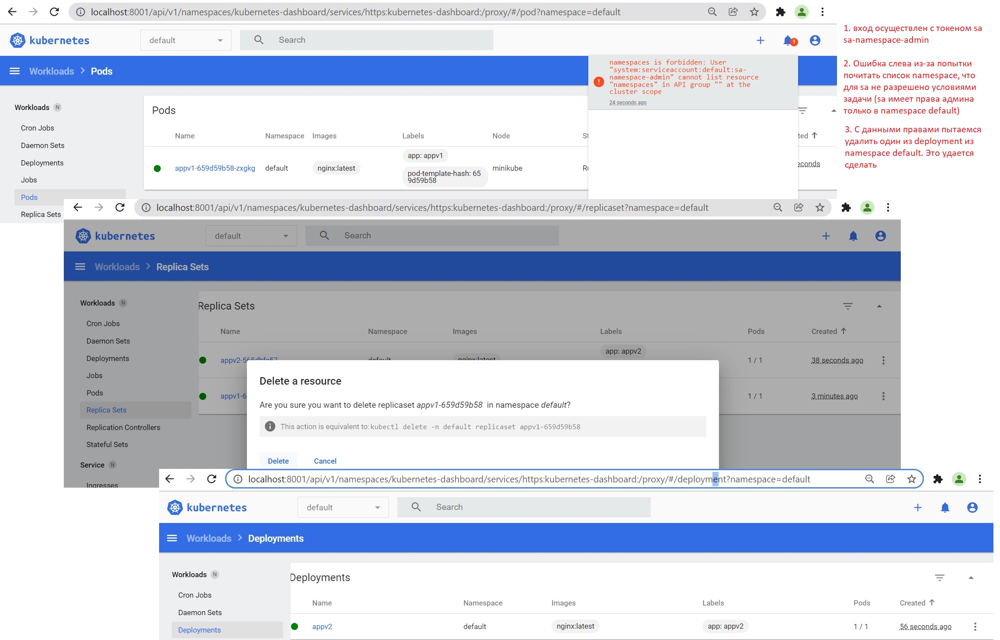

## Hello Alexey!

## Homework
### Create users deploy_view and deploy_edit. Give the user deploy_view rights only to view deployments, pods. Give the user deploy_edit full rights to the objects deployments, pods.

### Create namespace prod. Create users prod_admin, prod_view. Give the user prod_admin admin rights on ns prod, give the user prod_view only view rights on namespace prod.

### Create a serviceAccount sa-namespace-admin. Grant full rights to namespace default. Create context, authorize using the created sa, check accesses.

